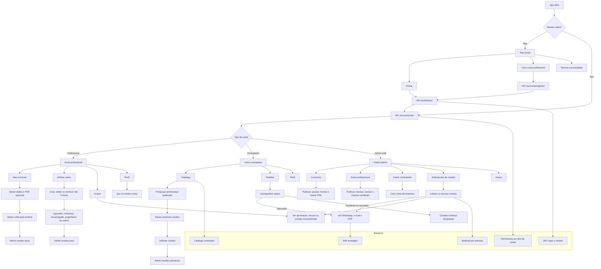

# Fluxograma geral - Apelmat Empregos

## Regras principais

- Cadastro publico cria somente conta profissional.
- Contratante e criado somente pelo admin.
- Profissional nao acessa catalogo de outros profissionais.
- Contratante ve catalogo, mas nao ve WhatsApp, e-mail nem PDF antes da liberacao.
- Admin controla publicacao de curriculo, publicacao de area e liberacao de contato.
- Cada profissional pode cadastrar no maximo 3 areas.
- PDF do curriculo so e baixado pelo proprio profissional, pelo admin ou por contratante aprovado.
